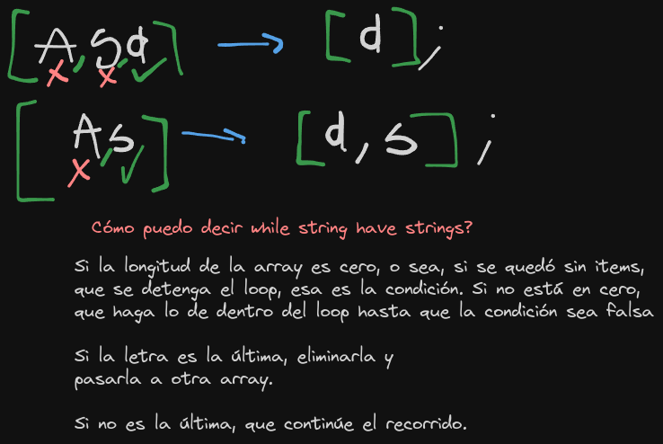

## Problem IV (Reversed Strings)
## Description
Complete the solution so that it reverses the string passed into it.
## Expected Output
```
'world'  =>  'dlrow'
'word'   =>  'drow'
```
## My solution
[First solution for the reversed string problem](https://github.com/Blisse1/codewars/blob/main/kata-VIII/reversed-strings.js)
## Other people's solutions
Bueno, nada como proponer una solución super verbosa y que la solución sea de una línea.
Sin embargo, no me siento para nada mal. Lo hice presionándome como si no existiera un método para eso.
También se me pasó por alto revisar todos los métodos de Array.prototype. Sí alcancé a mirar
que había un toReversed() pero no un reversed() directamente. Ahí ya lo tengo en cuenta para
otro momento.
## Improved Final Solution
```js
function solution(str){
  return str.split("").reverse().join("");
}
```
## Insight
Bueno, esta me tuvo cabezón porque no tenía la menor idea de cómo hacerlo.
La forma en la que abarco las cosas cuando no las sé hacer es por un principio
que tengo muy arraigado. Y ese es el de empezar a construir desde lo más simple.
En este ejercicio llegué a un punto en donde solo quería conseguir que la última letra
al menos poder meterla en una array y que al mismo tiempo se eliminara de la array de la palabra
ordenada. Y ya cuando lo conseguí, solo fue cuestión de pensar que necesitaba encerrar eso
en un loop que lo repitiera para cada última palabra hasta que la array de la palabra original
quedara vacía. Bueno, eso hasta que me di cuenta un método que pasé por alto llamado reverse()

## Excalidraw graph


